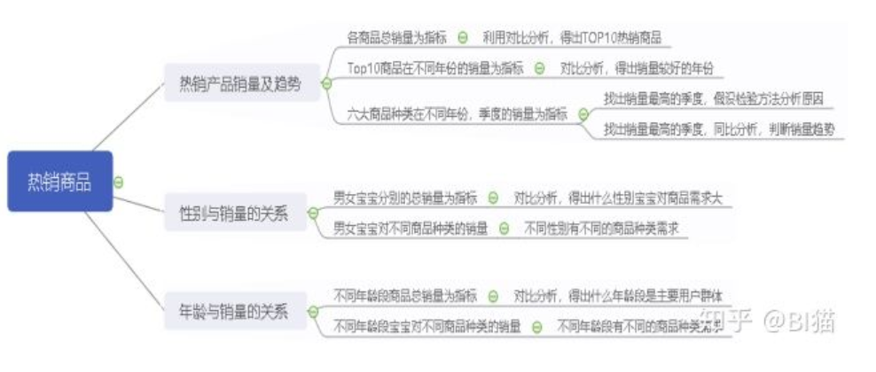

# 业务分析方法

## 常见业务分析方法整理

1. PEST分析法：

PEST分析法是指从**政治（Politics）**、**经济（Economic）**、**社会（Society）**、**技术（Technology）**四个方面，基于公司战略的眼光来分析企业外部宏观环境的一种方法。公司战略的制定离不开宏观环境，PEST分析法能从各个方面比较好的把握宏观环境的现状及变化的趋势，有利于企业对生存发展的机会加以利用，对环境可能带来的威胁及早发现避开。

**政治**，是指一个国家或地区的政治制度、体制、方针政策、法律法规等方面。这些因素常常影响着企业的经营行为，尤其是对企业长期的投资行为有着较大影响。

**经济**，指企业在制定战略过程中须考虑的国内外经济条件、宏观经济政策、经济发展水平等多种因素

**社会**，主要指组织所在社会中成员的民族特征、文化传统、价值观念、宗教信仰、教育水平以及风俗习惯等因素。

**技术**，是指企业业务所涉及国家和地区的技术水平、技术政策、新产品开发能力以及技术发展的动态等。

具体到互联网行业的分析模式如下：

2. SWOT分析法

SWOT分析法，又称态势分析法或优劣势分析法，用来确定企业自身的竞争优势（strength）、竞争劣势（weakness）、机会（opportunity）和威胁（threat），从而将公司的战略与公司内部资源、外部环境有机地结合起来，常被用于**制定集团发展战略和分析竞争对手情况**。其中，S、W是内部因素，O、T是外部因素。SWOT分析法主要是着眼于企业自身的实力及其与竞争对手的比较，而机会和威胁分析将注意力放在外部环境的变化及对企业的可能影响上。在分析时，应把所有的内部因素（即优劣势）集中在一起，然后用外部的力量来对这些因素进行评估。SWOT分析法**帮你清晰地把握全局，分析项目在各方面的优势与劣势，把握环境提供的机会，防范可能存在的风险与威胁，对项目的成功有非常重要的意义**。

**优势**，是组织机构的内部因素，具体包括：有利的竞争态势；充足的财政来源；良好的企业形象；技术力量；规模经济；产品质量；市场份额；成本优势；广告攻势等。

**劣势**，也是组织机构的内部因素，具体包括：设备老化；管理混乱；缺少关键技术；研究开发落后；资金短缺；经营不善；产品积压；竞争力差等。

**机会**，是组织机构的外部因素，具体包括：新产品；新市场；新需求；外国市场壁垒解除；竞争对手失误等。

**威胁**，也是组织机构的外部因素，具体包括：新的竞争对手；替代产品增多；市场紧缩；行业政策变化；经济衰退；客户偏好改变；突发事件等。

在SWOT分析的基础上，可以得到可供选择的四种基本战略类型：

- SO战略就是依靠内部优势去抓住外部机会的战略；
- WO战略是利用外部机会来改进内部弱点的战略；
- ST战略就是利用内部优势,去避免或减轻外部威胁的打击；
- WT战略就是直接克服内部弱点和避免外部威胁的战略。

3. 5W2H分析法

5W2H分析法是以五个W开头的英语单词和两个H开头的英语单词进行提问，从回答中发现解决问题的线索，即Why，What，Who，When，Where，How，How much，这就是5W2H的分析法构架。

该方法简单方便，易于理解和使用，广泛用于企业营销、管理活动，对于决策和执行性的活动措施非常有帮助，也可以弥补考虑问题的疏漏。以用户的购买行为为例分析如下：

Mindmaster是一款非常好用的思维导图工具。支持现在免费试用网页版。比如说像下面的这个热销产品分析图就是使用Mindmaster做的：

4. 逻辑树分析法

逻辑树，又称问题树、演绎树。是一种以树形结构系统地分析存在的问题及其相互关系的方法。逻辑树是将问题的所有子问题分层罗列，从最高层开始，并逐步向下扩展。逻辑树能保证解决问题过程的完整性，他能将工作细分为便于操作的任务，确定各部分的优先顺序，明确地把责任落实到个人。

逻辑树的作用主要是帮助你理清思路，避免进行重复和无关的思考。必须遵守以下三个原则：
- 要素化：把相同问题总结归纳成要素
- 框架化：将各个要素组织成框架，遵守不重不漏的原则
- 关联化：框架内的各要素保持必要的相互关系，简单而不孤立

逻辑分析法在理论分析中的运用如下：

5. 4P营销理论

4P营销理论是随着营销组合理论的提出而出现的，营销组合其实有几十个要素，这些要素可以归纳为4类：产品（Product）、价格（Price）、渠道（Place）、促销（Promotion）。

**产品（Product）：** 从市场营销的角度看，产品是指市场提供给消费者以满足其某种需要的任何东西，包括有形产品、服务、人员、组织、观念或他们的组合。

**价格（Price）:** 是指顾客购买产品时的价格，包括基本价格、折扣价格、支付期限等。价格决策关系到企业的利润、成本补偿等问题。影响定价的主要因素有三个：需求、成本和竞争。最高价格取决于市场需求，最低价格取决于成本，企业定价取决于其竞争对手同类产品的价格。

**渠道（Place）：** 是指产品从生产企业到消费者手上所经历的各个环节。

**促销（Promotion）：** 是指企业通过销售行为的改变来促进消费者的购买，比如买一送一、营造现场气氛等。

4P营销理论在公司业务分析中的应用如下：

6. 用户行为理论

**用户使用行为是指用户为获取、使用物品或服务所采取的各种行动，用户对产品首先需要有一个认知、熟悉的过程，然后试用，再决定是否继续消费使用，最后成为忠诚用户**。用户使用行为的完整过程如下所示。

我们可以利用用户使用行为理论，梳理网站分析的各关键指标之间的逻辑关系，构建符合公司实际业务的网站分析指标体系，如下所示：

7. 杜邦分析法

杜邦分析法又称杜邦财务分析体系，是利用各主要财务指标间的内在联系，对企业财务状况及经济效益进行综合分析评价的方法。

该体系以净资产收益率为龙头，以总资产收益率和权益系数为核心，重点揭示企业盈利能力及权益成数对净资产收益率的影响，以及各相关指标间的相互影响关系，为各级管理者优化经营理财状况、提高公司经营效益提供思路。提高总资产收益率的根本在于扩大销售、节约成本、优化投资配置、加速资金周转、优化资金结构、确定风险意识等。

特点：将若干个用以评价企业经营效率和财务状况的比率按其内在联系有机地结合起来，形成一个完整的指标体系，并最终通过权益收益率来总和反映。采用金字塔结构，使财务比率分析的层次更清晰、条例更突出，简洁明了地表达了各财务指标之间的关系。

## 管理客户表格

做好客户资料整理是特别重要的一件事，正所谓磨刀不误砍柴工。其实做销售的大部分时间也是在分析客户，然后精准定位跟进客户。如果能够系统的，有序的做好客户资源管理，不仅可以提高我们的效率，还能清楚地了解客户，维护客户关系，理顺跟进情况，从而提高成单率。那怎样进行客户资料管理呢？这就是本文接下来的内容。

首先我们要思考哪些资料是需要整理：
- 客户公司信息；
- 联系人信息；
- 订单跟进情况信息；
- 样机信息；
- 总订单记录信息
- 等等。

确定好这些所需要的信息后，我们就可以从资料的整体和局部关系问题分析，确定管理的整体思路。

资料的整体和局部关系：对于个别客户，它的基本信息和业务明细，建议不要放在同一个表格中，分开成多个表格。可以分成如下几个表格：
- 联系人表格，
- 客户公司信息表格，
- 客户跟进表格，
- 客户购买记录表格，
- 客户国家信息表格等等；

对于多个客户，按照等级分类，可分为ABCD等级归类；这样方便区分和记录。但是这些表格不是完全独立的，而是依据客户内在地联系在一起，是一个整体。这些单独表格整合在一起能够方便我们了解一个客户的全部信息。

现在我们来看看具体实际操作。

将客户分为A（贵宾客户） B（种子客户） C（潜在客户） D（中断客户）四个等级，
- A类客户是指每年稳定返单，并且订单量大的客户；
- B类客户是指行业内的优质品牌商，有过合作但是没有稳定返单的客户；
- C类客户是我们所在行业待开发的客户；
- D类客户是指订单在进行但是量小或不稳定客户；

四类每一类建一个文件夹。客户文件夹名字可以这样编号：**区域+国际+客户缩写**，像: 欧洲+德国+Fakir，欧洲德国客户Fakir，这样我们就可以建立这个客户的资料管理表格了。

1. 联系人信息表

包含认识客户途径(例如通过展会，B2B平台询盘，社交方式facebook, linkedin等认识)；职位，这样利于我们和客户谈判的方式，因为不同职位权限不同。比如采购助理他是没有决策权的，和他接触时我们需要表现出我们理解他需要报告给上级，给他提供全方面的资料，最佳合作方案。这样会让客户感觉我们就是他的同事，一起服务好他的上级，不给他添麻烦；职业生涯，通过社交工具如linkedin 了解客户的工作经历，判断客户对这个行业的了解程度。宗教信仰，兴趣爱好，来中国频率等等，我们可以通过facebook等多去了解，这样方便我们可以和客户有话题聊，在和客户用餐时也可以避免他们的禁忌；通过来中国的频率也可以判断客户对中国的了解程度，比较频繁侧面反映出客户公司经常有和中国的业务往来，相反没有来过或者第一次从中国采购的，我们可以在报关时给客户提供帮助，让客户放心。最后是客户邮箱，电话，传真，skype 等基本联系方式。

2. 客户公司信息表

可以通过客户网站分析知道客户公司的基本情况，比如成立的年限，主营产品，公司优势等，组织架构，销售方式。我们也可以问问联系人关于他们公司的情况，尤其是见面时客户展示他们公司的PPT，及时记录有效信息。从网站分析产品，best seller 到new products, 我们都要去分类，看看客户新产品“新”体现在哪，我们是否可以生产满足。Best seller有什么卖点，结合我们对行业的了解，看是否能知道其供应商。通过客户的新闻News去了解客户近期发生的重大事件。

3. 客户国家信息表

对客户和其公司了解后，我们还需要对客户所在的国家建立档案。我们需要去关注这个国家的经济水平，政治文化，法律法规，消费特征，旅游资讯等。比如节日，大家都知道的穆斯林斋月节，我们需要提前去预防节日带来的不方便。例如南非黑人国家喜欢闪亮闪亮的东西，而美国觉得很闪的东西档次显得低，所以他们喜欢哑光的表面处理工艺，因此国外的差异也是需要我们去收集整理。

4. 客户跟进表

这个跟进表可分为等级客户跟进表及优先客户跟进表。对于潜在客户或有意向客户，我们需要对同等级的跟进情况做简单记录，例如初次报价时间，报价数量，单价等等，可以理解为跟进历史存档和跟进日程提示。

前面的“等级客户跟进表”记录的对象就如沙子，而“优先客户跟进表”记录的对象就是从沙淘出来的金。也就是从上面挑出来很有可能成单客户，属于重要但不紧急，高回报的客户，是我们需要花时间和精力去跟进的对象。报价时间，数量，单价，交货期，客户要求，每一次联系的大概内容等等我们都必须记录。

5. 订单执行情况表

订单执行情况表是目前正在进行的订单，是跟进客户的关键环节，关系到整个外贸流程是否能顺利走完，既重要又紧急，需要我们高度重视。每一个流程的节点在哪，进行的如何都是我们需要更新以便去掌控避免突发情况。如我们给工厂的交货期，工厂回复的交货期，原料采购期，生产进度，船公司给的船期等。对于一些老外贸人员来说可能同时跟进几个订单，这个表格的作用更重要。

当然我们也可以把正在跟进的样品单也放在此表格一起。

6. 样机，订单记录表

送样成单后，我们也还是需要去整理客户的年订单量。可以将所有成单客户放在同一个表格，按照年份不同记录在一个sheet中，记录客户每一个客户每一单的出货时间，到港日期，付款方式，订单单价，数量，总额，销售情况记录。 这样我们便可以从表格中去判断客户大概的采购月份，参考销售情况去适时催客户翻单。

样机记录表会稍有不同，但是同样重要，客户询问了样品，说明他还是对我们的产品感兴趣的。除了基本的数量，交期，是否免费情况等，对于有些有特殊功能区分的，我们需要把功能，颜色，特殊规格记录清楚，因为这些都涉及到大货，我们需要从一开始就杜绝错误，让客户放心。

整理完这些表格后，是不是感觉思路清晰了很多？外贸其实不是闷着头去开发客户，开发了客户后我们需要去整理，分析挖掘有质量的客户，理清思路，将日常工作适度流程化，达到事半功倍的效果。

## 客户细分的五个步骤

数据分析：客户细分的五个过程

第一步，客户特征细分。一般客户的需求主要是由其社会和经济背景决定的，因此对客户的特征细分，也即是对其社会和经济背景所关联的要素进行细分。这些要素包括地理（如居住地、行政区、区域规模等）、社会（如年龄范围、性别、经济收入、工作行业、职位、受教育程度、宗教信仰、家庭成员数量等）、心理（如个性、生活型态等）和消费行为（如置业情况、购买动机类型、品牌忠诚度、对产品的态度等）等要素。

第二步，客户价值区间细分。不同客户给企业带来的价值并不相同，有的客户可以连续不断地为企业创造价值和利益，因此企业需要为不同客户规定不同的价值。在经过基本特征的细分之后，需要对客户进行高价值到低价值的区间分隔（例如大客户、重要客户、普通客户、小客户等），以便根据**20%的客户为项目带来80%的利润**的原理重点锁定高价值客户。客户价值区间的变量包括：客户响应力、客户销售收入、客户利润贡献、忠诚度、推荐成交量等等。

第三步，客户共同需求细分。围绕客户细分和客户价值区隔，选定最有价值的客户细分作为目标客户细分，提炼它们的共同需求，以客户需求为导向精确定义企业的业务流程，为每个细分的客户市场提供差异化的营销组合。

第四步，选择细分的聚类技术。目前多采用聚类技术来进行客户细分。常用的聚类方法有K-means、神经网络等，企业可以根据不同的数据情况和需要，选择不同聚类算法来进行客户细分。同时将收集到的原始数据，转换成相应的数据模型所支持的格式，这个过程称为数据初始化和预处理。

第五步，评估细分结果。在对客户群进行细分之后，会得到多个细分的客户群体，但是，并不是得到的每个细分都是有效的。细分的结果应该通过下面几条规则来测试:与业务目标相关的程度;可理解性和是否容易特征化;基数是否足够大，以便保证一个特别的宣传活动;是否容易开发独特的宣传活动等。

# 2020年4月1日 儿子的英语作业

## 汉译英：
1. 我想加入运动俱乐部，因为我擅长踢足球。

I want to join the sport club because I am good at playing football.

2. 你可以参加歌唱比赛因为你唱歌不错

You can join in singing competitions because you sing well.

3. 我们不被允许在学校内使用手机。

We are not allowed to use mobile phone in the school.

allow vi. 允许

use vt. 使用

mobile 移动

phone 电话

4. 我们必须穿校服到校上课。

A. We must wear school uniforms to school.

B. We must go to school(上学) in a school dress.

C. We must go to school with school dress.

校服： school uniforms

5. 在图书馆大声喧哗是绝对禁止的行为。

Loud noise is an absolutly prohibited action in the libaries.

prohibited = forbidden

6. 上周，我们乘坐校车去了科技博物馆。

Last week, we went to the scientific museum by the school bus.

scientific: 科学的。

7. 那里有很多可以做的事情和可以看得东西。

There are many thing to do and many thing to see.

8. 我们不仅参观了机器人表演还学做了机器人模型。

We not only visited the robot show but also learned to make robot model.

9. 我喜欢在室外工作，因为我可以帮助打扫城市公园。

I like working outside because I can help to clean the city park.

10. 我想去拜访老人之家的老人们，并且听他们讲述过去的故事。

I want to visit the old people in the elderly home and listen to them tell stories of the past.

11. 做志愿者不仅让我学到了很多，还让我有了强烈的自我满足感。

Volunteering not only taught me a lot, but also gave me a strong sense of self-satisfaction.
