# 业务分析方法

## 常见业务分析方法整理

1. PEST分析法：

PEST分析法是指从**政治（Politics）**、**经济（Economic）**、**社会（Society）**、**技术（Technology）**四个方面，基于公司战略的眼光来分析企业外部宏观环境的一种方法。公司战略的制定离不开宏观环境，PEST分析法能从各个方面比较好的把握宏观环境的现状及变化的趋势，有利于企业对生存发展的机会加以利用，对环境可能带来的威胁及早发现避开。

**政治**，是指一个国家或地区的政治制度、体制、方针政策、法律法规等方面。这些因素常常影响着企业的经营行为，尤其是对企业长期的投资行为有着较大影响。

**经济**，指企业在制定战略过程中须考虑的国内外经济条件、宏观经济政策、经济发展水平等多种因素

**社会**，主要指组织所在社会中成员的民族特征、文化传统、价值观念、宗教信仰、教育水平以及风俗习惯等因素。

**技术**，是指企业业务所涉及国家和地区的技术水平、技术政策、新产品开发能力以及技术发展的动态等。

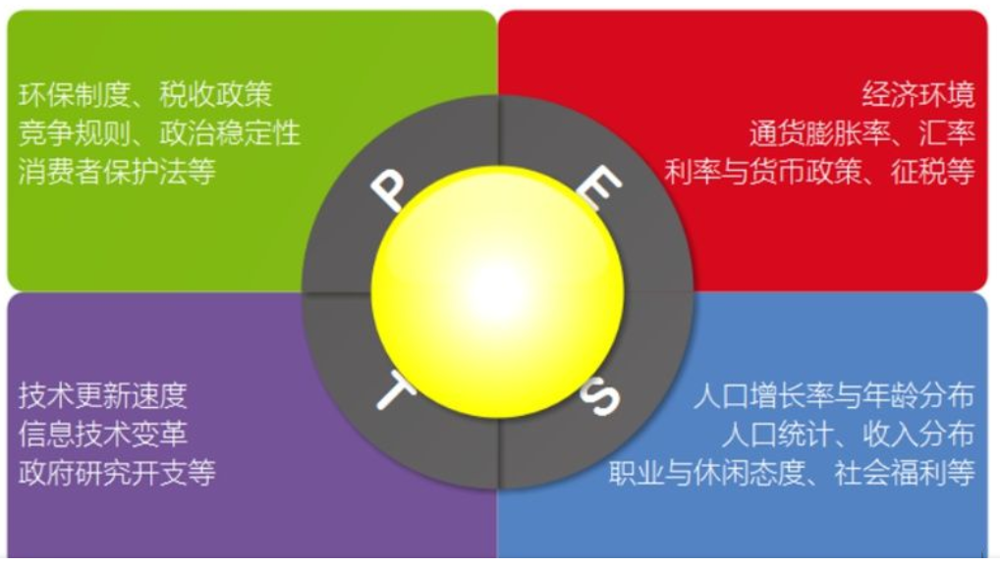

具体到互联网行业的分析模式如下：

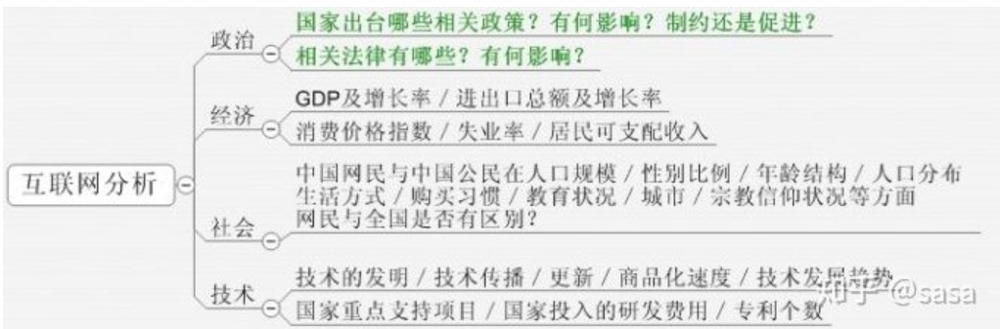

2. SWOT分析法

SWOT分析法，又称态势分析法或优劣势分析法，用来确定企业自身的竞争优势（strength）、竞争劣势（weakness）、机会（opportunity）和威胁（threat），从而将公司的战略与公司内部资源、外部环境有机地结合起来，常被用于**制定集团发展战略和分析竞争对手情况**。其中，S、W是内部因素，O、T是外部因素。SWOT分析法主要是着眼于企业自身的实力及其与竞争对手的比较，而机会和威胁分析将注意力放在外部环境的变化及对企业的可能影响上。在分析时，应把所有的内部因素（即优劣势）集中在一起，然后用外部的力量来对这些因素进行评估。SWOT分析法**帮你清晰地把握全局，分析项目在各方面的优势与劣势，把握环境提供的机会，防范可能存在的风险与威胁，对项目的成功有非常重要的意义**。

**优势**，是组织机构的内部因素，具体包括：有利的竞争态势；充足的财政来源；良好的企业形象；技术力量；规模经济；产品质量；市场份额；成本优势；广告攻势等。

**劣势**，也是组织机构的内部因素，具体包括：设备老化；管理混乱；缺少关键技术；研究开发落后；资金短缺；经营不善；产品积压；竞争力差等。

**机会**，是组织机构的外部因素，具体包括：新产品；新市场；新需求；外国市场壁垒解除；竞争对手失误等。

**威胁**，也是组织机构的外部因素，具体包括：新的竞争对手；替代产品增多；市场紧缩；行业政策变化；经济衰退；客户偏好改变；突发事件等。

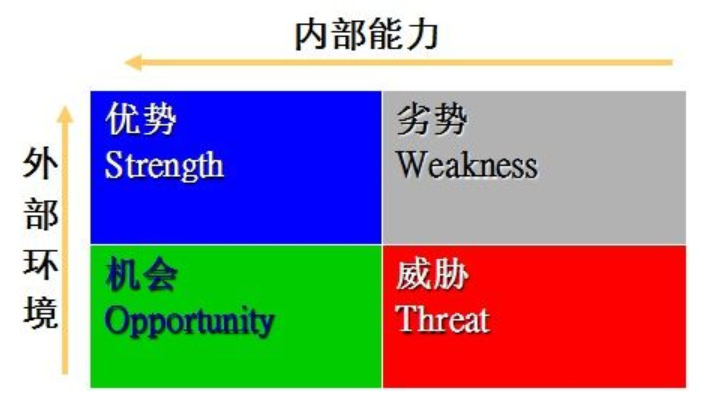

在SWOT分析的基础上，可以得到可供选择的四种基本战略类型：

- SO战略就是依靠内部优势去抓住外部机会的战略；
- WO战略是利用外部机会来改进内部弱点的战略；
- ST战略就是利用内部优势,去避免或减轻外部威胁的打击；
- WT战略就是直接克服内部弱点和避免外部威胁的战略。

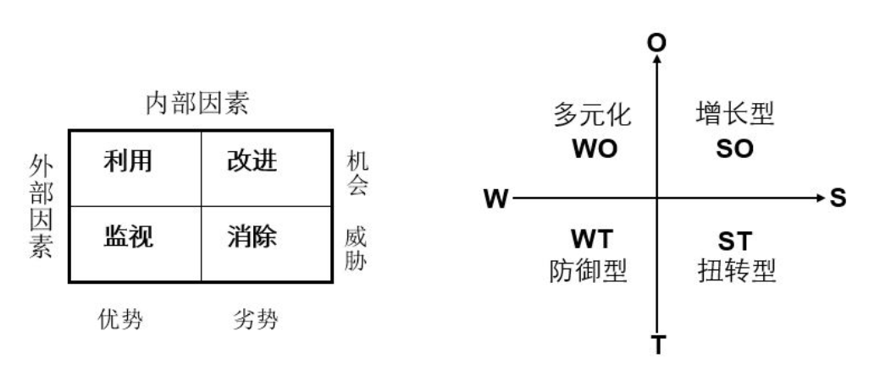

3. 5W2H分析法

5W2H分析法是以五个W开头的英语单词和两个H开头的英语单词进行提问，从回答中发现解决问题的线索，即Why，What，Who，When，Where，How，How much，这就是5W2H的分析法构架。

该方法简单方便，易于理解和使用，广泛用于企业营销、管理活动，对于决策和执行性的活动措施非常有帮助，也可以弥补考虑问题的疏漏。以用户的购买行为为例分析如下：

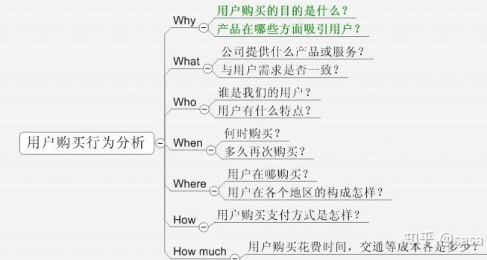

4. 逻辑树分析法

逻辑树，又称问题树、演绎树。是一种以树形结构系统地分析存在的问题及其相互关系的方法。逻辑树是将问题的所有子问题分层罗列，从最高层开始，并逐步向下扩展。逻辑树能保证解决问题过程的完整性，他能将工作细分为便于操作的任务，确定各部分的优先顺序，明确地把责任落实到个人。

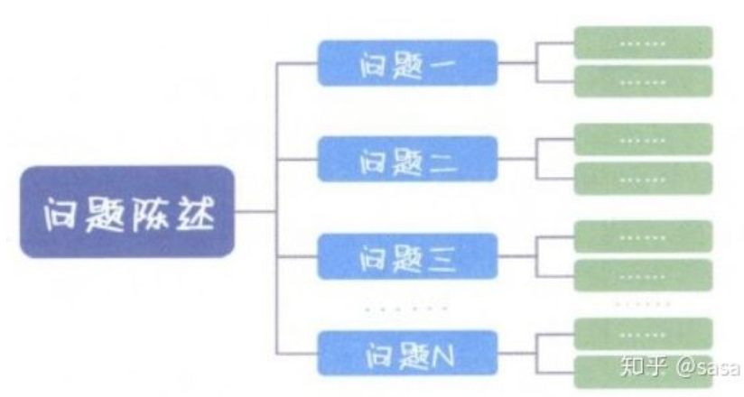

逻辑树的作用主要是帮助你理清思路，避免进行重复和无关的思考。必须遵守以下三个原则：
- 要素化：把相同问题总结归纳成要素
- 框架化：将各个要素组织成框架，遵守不重不漏的原则
- 关联化：框架内的各要素保持必要的相互关系，简单而不孤立

逻辑分析法在理论分析中的运用如下：

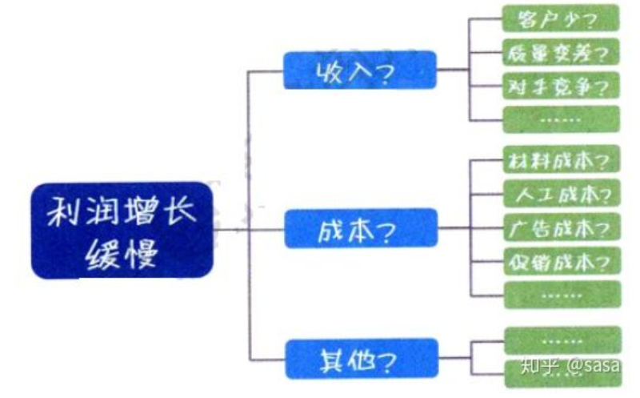

5. 4P营销理论

4P营销理论是随着营销组合理论的提出而出现的，营销组合其实有几十个要素，这些要素可以归纳为4类：产品（Product）、价格（Price）、渠道（Place）、促销（Promotion）。

**产品（Product）：** 从市场营销的角度看，产品是指市场提供给消费者以满足其某种需要的任何东西，包括有形产品、服务、人员、组织、观念或他们的组合。

**价格（Price）:** 是指顾客购买产品时的价格，包括基本价格、折扣价格、支付期限等。价格决策关系到企业的利润、成本补偿等问题。影响定价的主要因素有三个：需求、成本和竞争。最高价格取决于市场需求，最低价格取决于成本，企业定价取决于其竞争对手同类产品的价格。

**渠道（Place）：** 是指产品从生产企业到消费者手上所经历的各个环节。

**促销（Promotion）：** 是指企业通过销售行为的改变来促进消费者的购买，比如买一送一、营造现场气氛等。

4P营销理论在公司业务分析中的应用如下：

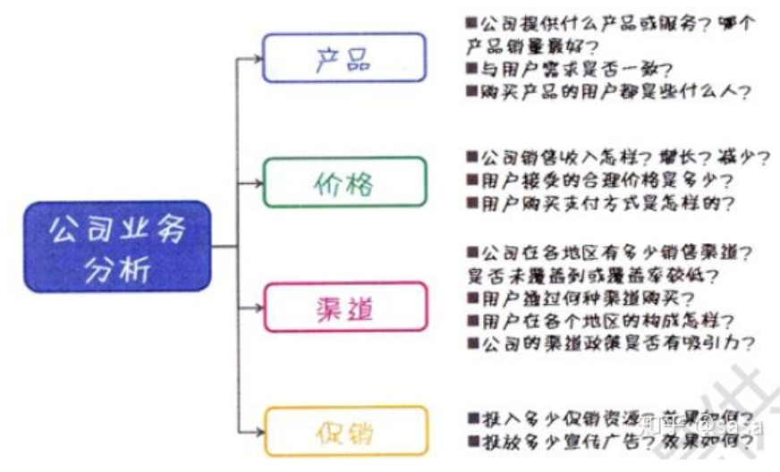

6. 用户行为理论

**用户使用行为是指用户为获取、使用物品或服务所采取的各种行动，用户对产品首先需要有一个认知、熟悉的过程，然后试用，再决定是否继续消费使用，最后成为忠诚用户**。用户使用行为的完整过程如下所示。

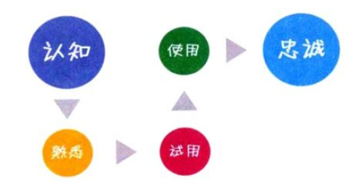

我们可以利用用户使用行为理论，梳理网站分析的各关键指标之间的逻辑关系，构建符合公司实际业务的网站分析指标体系，如下所示：

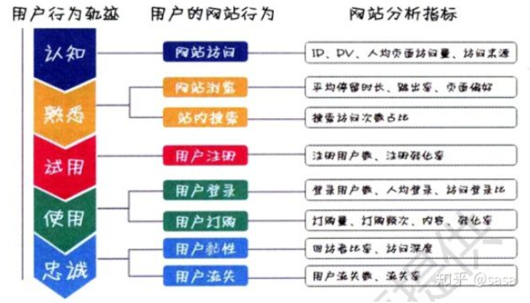

7. 杜邦分析法

杜邦分析法又称杜邦财务分析体系，是利用各主要财务指标间的内在联系，对企业财务状况及经济效益进行综合分析评价的方法。

该体系以净资产收益率为龙头，以总资产收益率和权益系数为核心，重点揭示企业盈利能力及权益成数对净资产收益率的影响，以及各相关指标间的相互影响关系，为各级管理者优化经营理财状况、提高公司经营效益提供思路。提高总资产收益率的根本在于扩大销售、节约成本、优化投资配置、加速资金周转、优化资金结构、确定风险意识等。

特点：将若干个用以评价企业经营效率和财务状况的比率按其内在联系有机地结合起来，形成一个完整的指标体系，并最终通过权益收益率来总和反映。采用金字塔结构，使财务比率分析的层次更清晰、条例更突出，简洁明了地表达了各财务指标之间的关系。

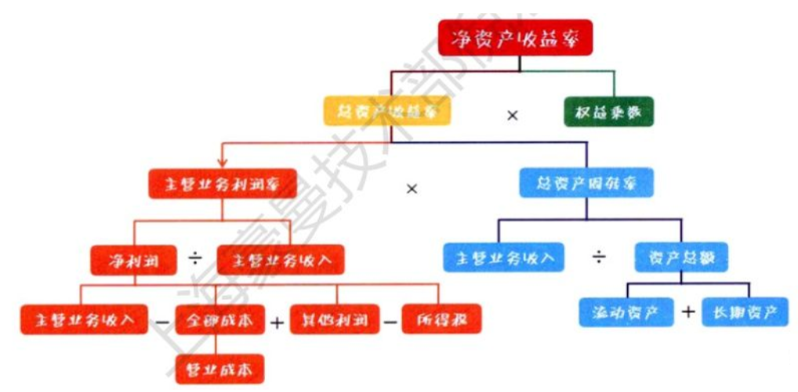

# 2020年4月1日 儿子的英语作业

## 汉译英：
1. 我想加入运动俱乐部，因为我擅长踢足球。

I want to join the sport club because I am good at playing football.

2. 你可以参加歌唱比赛因为你唱歌不错

You can join in singing competitions because you sing well.

3. 我们不被允许在学校内使用手机。

We are not allowed to use mobile phone in the school.

allow vi. 允许

use vt. 使用

mobile 移动

phone 电话

4. 我们必须穿校服到校上课。

A. We must wear school uniforms to school.

B. We must go to school(上学) in a school dress.

C. We must go to school with school dress.

校服： school uniforms

5. 在图书馆大声喧哗是绝对禁止的行为。

Loud noise is an absolutly prohibited action in the libaries.

prohibited = forbidden

6. 上周，我们乘坐校车去了科技博物馆。

Last week, we went to the scientific museum by the school bus.

scientific: 科学的。

7. 那里有很多可以做的事情和可以看得东西。

There are many thing to do and many thing to see.

8. 我们不仅参观了机器人表演还学做了机器人模型。

We not only visited the robot show but also learned to make robot model.

9. 我喜欢在室外工作，因为我可以帮助打扫城市公园。

I like working outside because I can help to clean the city park.

10. 我想去拜访老人之家的老人们，并且听他们讲述过去的故事。

I want to visit the old people in the elderly home and listen to them tell stories of the past.

11. 做志愿者不仅让我学到了很多，还让我有了强烈的自我满足感。

Volunteering not only taught me a lot, but also gave me a strong sense of self-satisfaction.
